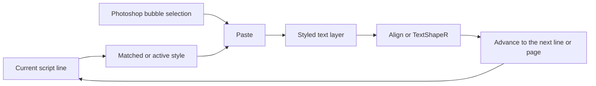

<p align="center">
  
</p>

<h1 align="center">TypeR</h1>

<p align="center">
  <strong>A faster script-to-bubble workflow for manga and comics typesetting in Adobe Photoshop.</strong>
</p>

<p align="center">
  Paste a script, route lines to the right styles, create and fit text layers, move through pages,
  and share a consistent setup with your team, all without leaving Photoshop.
</p>

<p align="center">
  <a href="https://github.com/ScanR/TypeR/releases/latest/download/TypeR.zip"><strong>Download the stable release</strong></a>
  ·
  <a href="https://github.com/ScanR/TypeR/releases">Release notes</a>
  ·
  <a href="https://discord.com/invite/Pdmfmqk">Support</a>
</p>

<p align="center">
  <a href="https://github.com/ScanR/TypeR/releases/latest"></a>
  <a href="https://github.com/ScanR/TypeR/releases"></a>
  
  
  <a href="./LICENSE.md"></a>
</p>

---

TypeR is a free, open-source Photoshop panel built for typesetters working on translated manga and comics. It keeps the script, page navigation, bubble selection, text placement, and typography styles in one compact workspace.

Instead of repeatedly switching between a script editor and Photoshop, the core loop becomes:

> **Select a bubble → create the styled text layer → fit or center it → advance to the next line.**

TypeR is based on [TyperTools](https://swirt.github.io/typertools/) by Swirt and extends it with modern typesetting workflows, stability fixes, and team-oriented style management.

## Why typesetters use TypeR

| Need | What TypeR provides |
| --- | --- |
| Work through a translated script quickly | Line-by-line navigation, ignored notes and empty lines, page markers, automatic page switching, and configurable hotkeys |
| Keep typography consistent | Separate project profiles with their own settings, scripts and style libraries, plus prefix matching and current-folder isolation |
| Place dialogue with fewer repetitive actions | Create or update a text layer from the active script line, auto-advance, internal bubble padding, and selection-based centering |
| Handle several bubbles at once | Multi-bubble capture and batch creation of consecutive text layers |
| Fit dialogue more naturally | TextShapeR suggestions shaped from a selection or an automatically detected bubble |
| Rebuild a project style kit | FontScanR turns typography found in existing PSD files into ready-to-use TypeR styles |
| Share a setup with a team | Export selected style folders and selected settings as JSON, optionally bundled with matching font files in a ZIP |
| Typeset in different languages | LTR and RTL text direction, Middle Eastern text options, Arabic UI support, and ten interface languages |



## Core workflow

### Script-first typesetting

Paste your translated script directly into TypeR. Each usable line becomes a step in the typesetting queue, while empty lines and configured translator-note prefixes can be skipped automatically.

Use `Page 1`, `Page 2`, `Page 12 :`, `Page 12 : title`, `Page 12 - title`, `[Page 12]` or `## Page 12` headings to connect the script to imported page files. TypeR can open the matching page as you advance, and can optionally save and close the previous PSD to keep long chapters manageable.

```text
Page 1
REG: This is regular dialogue.
SFX: BOOM!
## Translator note: keep the sign in the background.
```

Page imports accept `.psd`, `.png`, `.jpg`, and `.jpeg` files. TypeR sorts the selected files naturally before matching them to page markers.

### Prefix-driven styles

Assign prefixes such as `REG:`, `THOUGHT:`, `SFX:`, or any convention used by your team to a style. When a script line matches, TypeR selects the corresponding style automatically and removes the prefix from the text placed in Photoshop.

Styles can be created manually or copied from an existing Photoshop text layer. They support the properties typesetters regularly need, including:

- font family and face, size, leading, kerning, tracking, and horizontal or vertical scale;
- alignment, baseline shift, anti-aliasing, synthetic bold and italic, underline, and strikethrough;
- text color and outline/stroke settings;
- Arabic and Middle Eastern typography offsets.

Styles can be grouped into nested folders, duplicated, and reordered. By default, automatic prefix matching only uses styles from the exact folder containing the active style, so script tags cannot switch to another folder. This isolation can be disabled in **Settings → Behavior**, and automatic prefix matching can also be disabled per style.

### Placement, centering, and batch insertion

Draw a Photoshop selection around a bubble with your preferred selection tool. TypeR can then:

- create a styled text layer from the active script line and advance automatically;
- replace the text and style of one or more selected text layers;
- distribute consecutive script lines across selected text layers in selection order;
- insert only the text while preserving the layer's current style;
- center one or more selected text layers in the selection and optionally resize their text boxes;
- keep configurable internal padding between the text and the bubble edge;
- capture multiple bubbles and create consecutive text layers in one action;
- create either point text or paragraph text layers, globally or with a per-style override.

Font size controls can update the active layer without opening Photoshop's Character panel. If no selection exists during alignment, TypeR can also try to detect the surrounding bubble with a contiguous Magic Wand selection.

## Advanced tools

### TextShapeR

TextShapeR generates alternative line-break shapes for the current dialogue so it can sit more naturally inside a bubble. It can work from:

- the active Photoshop selection;
- the outline of a bubble detected around the selected text layer.

Preview several fitted suggestions, apply one, apply and advance, undo the last result, or chain the process across multiple selected text layers.

The inline TextShapeR panel is optional and can be disabled when maximum panel performance is preferred.

### FontScanR

FontScanR scans one or more `.psd` files and inventories the typography used by their text layers. It detects the font, commonly used size, text color, stroke, and anti-aliasing, then lets you choose which results should become TypeR styles.

This is especially useful when joining an existing project, recovering a style guide from finished pages, or standardizing a team's legacy PSD files.

### Team handoff and backups

The export panel lets you choose which folders, styles, and fonts to include, with an optional subset of application settings.

Project profiles keep styles, folders, settings, tabs, saved work, and custom backgrounds isolated. For backward compatibility, the initial **Default** profile remains in the original `storage` file and cannot be deleted, though it can be renamed. Additional profiles use separate storage files and can be created, switched, renamed, or deleted from **Settings → Profiles**. The export panel can export any profile without switching the active workspace first.

- Use JSON for a lightweight style/settings backup.
- Export only selected folders when sharing a project-specific kit.
- Include matching installed `.ttf`, `.otf`, `.ttc`, or `.otc` files in a ZIP when the font license permits redistribution.

The optional settings payload covers selected workflow preferences; it is not a complete clone of every shortcut, theme, tab, or layout setting.

When an installed font cannot be found, TypeR reports it instead of silently omitting it. The Windows and macOS installers also preserve TypeR's local storage during an update.

## Supported formats

| Workflow | Supported input or output |
| --- | --- |
| Script | Plain text typed or pasted into the panel, with optional rich-text/Markdown conversion |
| Synchronized pages | `.psd`, `.png`, `.jpg`, `.jpeg` |
| FontScanR | `.psd` |
| Style folders and selected settings | `.json` |
| Style kit with font files | `.zip` containing JSON and locally found `.ttf`, `.otf`, `.ttc`, or `.otc` files |
| Distributed installer | `.zip` |

## Install

### Requirements

| | Declared compatibility |
| --- | --- |
| Adobe Photoshop | CC 2015 / version 16.0 or newer |
| Operating system | Windows or macOS |
| Photoshop build | Standard desktop installation with CEP extension support |

Photoshop 16.0+ and CEP 6+ are declared by the extension manifest. TypeR 3.0 contains two builds of the same application: Photoshop 2020+ with Chromium 74+ loads the modern build; older or unknown runtimes load the compatibility build automatically. The project does not yet maintain a verified OS/version matrix, so compatibility is not guaranteed for every Photoshop and operating-system combination. Portable or heavily modified Photoshop builds may not load CEP panels correctly.

TypeR is distributed as an unsigned CEP extension. Both installers place it in the user-level Adobe CEP extensions folder and configure the required CSXS debug setting.

### Windows

1. [Download the latest `TypeR.zip`](https://github.com/ScanR/TypeR/releases/latest/download/TypeR.zip).
2. Extract the archive completely.
3. Close Photoshop.
4. Double-click `install_win.cmd` and follow the terminal prompts.
5. Reopen Photoshop and select **Window → Extensions → TypeR**.

### macOS

1. [Download the latest `TypeR.zip`](https://github.com/ScanR/TypeR/releases/latest/download/TypeR.zip).
2. Extract the archive and open Terminal in the extracted folder.
3. Close Photoshop, then run:

```sh
chmod +x install_mac.sh
./install_mac.sh
```

4. Reopen Photoshop and select **Window → Extensions → TypeR**.

On Apple Silicon, some Photoshop/CEP combinations may require Photoshop to be launched using Rosetta. If the panel is missing or disabled, check the [troubleshooting section](#troubleshooting).

### Update without opening TypeR

Keep the standalone updater from the downloaded archive and run it whenever you want to check for a stable update:

- On Windows, double-click `update_typer_win.cmd`.
- On macOS, run `chmod +x update_typer_mac.sh` once, then `./update_typer_mac.sh`.

The updater downloads the latest `TypeR.zip` release directly from GitHub. It validates the complete package before replacing files, preserves all `storage*` user data, and rolls back application files if installation fails. Reinstalling the same version can repair damaged application files. TypeR 3.0 packages include the integrity inventory required by these installers. Restart Photoshop after a successful update; TypeR itself does not need to be open.

## Your first typesetting session

1. Open TypeR from **Window → Extensions → TypeR**.
2. Paste your script into the text panel.
3. Optionally import the chapter pages and add `Page N` markers to the script.
4. Create a style or copy one from an existing Photoshop text layer, then assign its script prefix.
5. Select a bubble in Photoshop.
6. Click **Paste** or use the matching shortcut.
7. Use **Align** or TextShapeR to fit the text, then continue to the next line.
8. Export your style folders once the project setup is ready to share.

The built-in walkthrough can replay this complete workflow at any time from **Settings**.

## Default shortcuts

Every binding is customizable in **Settings → Shortcuts**. `Win` is TypeR's label for the operating-system meta key; it maps to the Windows key on Windows and Command on macOS. Likewise, `Alt` maps to Option on macOS.

| Action | Default shortcut |
| --- | --- |
| Create a styled layer in the selection and advance | `Win + Ctrl` |
| Apply the current line and style to the active layer | `Win + Shift` |
| Center the active layer in the selection | `Win + Alt` |
| Next line | `Ctrl + Enter` |
| Previous line | `Ctrl + Tab` |
| Increase text size | `Ctrl + Shift + Plus` |
| Decrease text size | `Ctrl + Shift + Minus` |
| Insert text into the active layer without changing its style | `Win + Shift + V` |
| Keep the active text size while creating or applying text | Hold `Alt` with the action |
| Select style 1 to 9 in the current folder, panel focused outside a text field | Numeric keypad `1` to `9` |
| Jump to the next page marker | `Shift + X` |
| Toggle multi-bubble mode | `Ctrl + Alt + M` |
| Jump to the previous page marker | Not assigned |
| Select the previous style | Not assigned |
| Select the next style | Not assigned |
| Apply only the active style to the selected text layer | Not assigned |
| Paste consecutive lines into selected text layers | Not assigned |
| Remove the last multi-bubble selection | Not assigned |
| Clear all multi-bubble selections | Not assigned |
| Toggle TextShapeR | Not assigned |
| Switch to the previous tab | Not assigned |
| Switch to the next tab | Not assigned |

Shortcut behavior can vary with keyboard layouts and operating-system bindings. If a combination conflicts with another application, assign a different one in TypeR. Settings warns when the same combination is assigned to more than one TypeR action.

## More productivity features

- Bold and italic Markdown/rich-text interpretation when pasting scripts.
- Multiple work tabs for keeping separate series and their page sync in one panel.
- Saved work states for restoring a script, imported pages, current line, and active style.
- Adjustable interface scale, panel order, visibility, and Photoshop-aware or editor-inspired themes.
- Quick style-size controls and configurable size increments.
- Automatic update checks with an in-app download flow.
- English, French, German, Spanish, Brazilian Portuguese, Russian, Turkish, Ukrainian, Vietnamese, and Arabic interfaces.

## Troubleshooting

<details>
<summary><strong>TypeR does not appear in Photoshop</strong></summary>

1. Confirm that the archive was extracted before running the installer.
2. Close every Photoshop window and run the installer again.
3. Restart Photoshop and look under **Window → Extensions → TypeR**.
4. On Apple Silicon, try launching Photoshop with **Open using Rosetta** enabled.
5. Confirm that you are using a standard desktop Photoshop build. Portable/light builds often remove or alter CEP support.

The included installers configure `PlayerDebugMode` for supported CSXS versions automatically.
</details>

<details>
<summary><strong>A shared style uses the wrong font</strong></summary>

The font must be installed on the receiving computer. TypeR can bundle matching font files with an export, but fonts that cannot be found are listed as missing. Only redistribute font files when their license allows it.
</details>

<details>
<summary><strong>I want to update without losing my setup</strong></summary>

The current installers back up and restore TypeR's local `storage` data during installation. For an additional portable backup, export your folders and settings to JSON before updating.
</details>

If the problem continues, [open an issue](https://github.com/ScanR/TypeR/issues/new) and include:

- your TypeR version, Photoshop version, and operating system;
- the exact steps that reproduce the problem;
- the expected and actual result;
- a screenshot, short recording, or sanitized PSD when relevant.

## Build from source

You only need Node.js and npm when developing TypeR or installing the current unreleased branch. Use Node 24 (see `.nvmrc`); the minimum build-tool version is Node 22.12. This does not change the Photoshop runtime requirement.

```sh
git clone --branch develop https://github.com/ScanR/TypeR.git
cd TypeR
npm install
npm run build
```

After it succeeds, install the extension with `install_win.cmd` on Windows or `./install_mac.sh` on macOS.

Useful development commands:

| Command | Purpose |
| --- | --- |
| `npm test` | Run the pure logic and locale test suites |
| `npm run build` | Create a production build |
| `npm run build_dev` | Create a development build |
| `npm run build_watch` | Rebuild while source files change |
| `npm run test:build` | Validate generated build artifacts |

## Contributing

Bug reports, translations, workflow suggestions, and pull requests are welcome. Please search the [existing issues](https://github.com/ScanR/TypeR/issues) before opening a new one and keep changes focused so they are easy to review and test.

For code changes, run `npm run verify` before submitting a pull request.

## Credits and license

TypeR is maintained by **Sakushi** and is based on [TyperTools](https://swirt.github.io/typertools/) by **Swirt**.

The project is distributed under the [MIT License](./LICENSE.md). For TypeR help, join the [ScanR support server](https://discord.com/invite/Pdmfmqk).

### Preparing a release

Run `npm run release` to test, build both runtimes, verify the artifacts and generate `Releases/TypeR.zip` with a SHA-256 checksum. `build_release.cmd` runs the same pipeline on Windows. Publish this built ZIP, which includes documentation and the license, rather than GitHub's source archive.

See [the release acceptance checklist](docs/release-3.0.0.md) for remaining real-Photoshop checks and recovery procedures. The existing video guide shows an earlier version; the in-panel walkthrough describes the current workflow.

For a full workspace backup, close Photoshop and copy every `storage*` file/directory from the TypeR extension folder. A settings export from one profile does not back up the other profiles.
